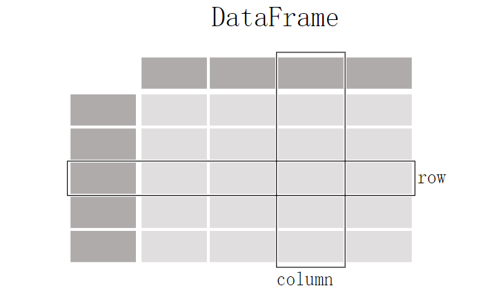

# [Pandas](https://pandas.pydata.org/docs/getting_started/intro_tutorials/index.html)

### 1、安装
> - `Anaconda`框架默认集成了无需安全装
> - `pip` 安装
> ~~~
>   pip install pandas
> ~~~
> 
### 2、pandas 处理的数据类型
> ##### **DataFrame**
>
> 
>
> 案例：
>
> ~~~python
> table = pd.DataFrame({
>  "姓名":['张三',"李四","王五","赵六"],
>  "年龄":[19,34,43,43],
>  "性别":["男","女","男","女"]
> })
> ~~~
>
> 
>
> ##### **Series**
> 
>
> 案例：
>
> ~~~python
> series = pd.Series(["11","12","13","14"],name="testColumn")
> ~~~
>
> 
>
> #### 方法
> - head()
> - tail()
> - describe()
> - read_*()
> - to_*()
> - info()
> - isin()
> - loc[]
> - iloc[]
> - plot()
> - plot.*()
> - rename()
> #### 属性
> - dtypes 
> - shape

### 3、官网文档

> [手册](https://pandas.pydata.org/docs/user_guide/10min.html)